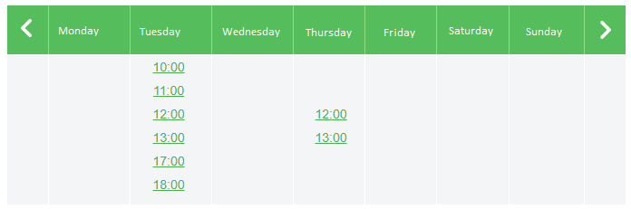

### Doctor Appointment

Doctors offer slots. A slot is a period of time which the patient could ask for a visit. The doctor defines a slot duration (for example, 20 minutes) and determines the work period (from 8 am to 1 pm, for example). The doctor expects that the patient will be able to see available slots and book an appointment (slot).

The user should be able to see slots by week. Make a selection and fill required data. This is it.

NOTE: In _Tools_ folder there is a Node file to test the GET and POST calls

**Get Availability**

```
GET https://localhost:8080/api/availability/GetWeeklyAvailability/yyyyMMdd
```

Observations: You must pass a valid date. That date should be 4 digits for the year, 2 for the month and 2 for the day. The availability is weekly based and always expect Monday as a valid request. 

Example: 1 January 2018 should be: 20180101 

The reply looks like: 

```
{
    "Facility":{
        "Name": Facility Name (string),
        "Address": Address (string)
    },
    "SlotDurationMinutes": Duration of the slot in minutes (int),
    "Monday":{
        "WorkPeriod":{
            "StartHour": Morning opening hour (int, from 0 to 23),                    
            "LunchStartHour": Morning closing hour (int, from 0 to 23),
            "LunchEndHour": Afternoon opening hour (int, from 0 to 23),
            "EndHour": Afternoon closing hour (int, from 0 to 23)
            },
        "BusySlots":[
            Array of taken slots. Can be empty. No one can pick one of those slots
        ]
    },
    "Tuesday":{
    ....
    }
    ....
}
```

**Take a Slot**

```
POST https://localhost:8080/api/availability/TakeSlot
```

You must post a valid JSON 

The JSON looks like: 

```
{        
    "Start": Start timestamp (string "YYYY-MM-dd HH:mm:ss"),
    "End": End timestamp (string "YYYY-MM-dd HH:mm:ss"),
    "Comments": Aditional instructions for the doctor (string),
    "Patient" : {
        "Name" : Patient Name (string),
        "SecondName" : Patient SecondName (string),
        "Email" :  Patient Email (string),
        "Phone" : Patient Phone (string)
    }
} 
```

**Silly example**
```
GET https://localhost:8080/api/availability/GetWeeklyAvailability/20170612
```
Response
```
{  
    "Facility":{  
        "Name":"Facility Example",
        "Address":"Josep Plà 2, Edifici B2 08019 Barcelona"
    },
    "SlotDurationMinutes":60,        
    "Tuesday":{  
        "WorkPeriod":{  
            "StartHour":10,
            "EndHour":13,
            "LunchStartHour":17,
            "LunchEndHour":19
        }
    },                
    "Thursday":{  
            "StartHour":10,
            "EndHour":13,
            "LunchStartHour":17,
            "LunchEndHour":19
        "BusySlots":[ 
            {
                "Start":"2017-06-15T10:00:00",
                "End":"2017-06-15T11:00:00"
            },
            {
                "Start":"2017-06-15T11:00:00",
                "End":"2017-06-15T12:00:00"
            },
            {
                "Start":"2017-06-15T17:00:00",
                "End":"2017-06-15T18:00:00"
            }
        ]
    }
}
```

User should be able to pick a correct week and pick a slot. 


(this image is just a suggestion) 

Then the user clicks on the slot, fills the data and post to the system 

```
POST: https://localhost:8080/api/availability/TakeSlot
```

```
{                        
    "Start":"2017-06-13 11:00:00",
    "End":"2017-06-13 12:00:00",
    "Patient" : {
        "Name" : "Mario",
        "SecondName" : "Neta",
        "Email" : "mario@email.com",
        "Phone" : "555 44 33 22"
    },
    "Comments":"my arm hurts a lot"
}
```