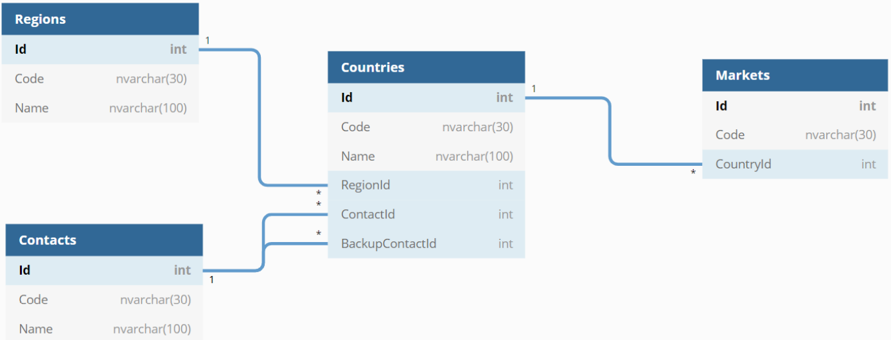

## Countries Info

Develop a .NET Core solution based in WPF according to the next premises: 

1. Feel free to create as many projects as you need. Of course, this is something that it will be
considered (in terms of software arquitecture). 

2. The application needs to be based in the next model:

3. Create an <mark>EF Core context class</mark> to work with this model. <u>Don´t use any database to store/retrieve data</u>, you only will need to provide information to the EF Model when the application is executed (seed the information).

4. Create a generic service layer, with an interface called IDataService<T> with the next methods:

    * <em>Task<IEnumerable<T>> GetAll();</em>
    * <em>Task<T> Get(int id);</em>
    * <em>Task<T> Create(T entity);</em>
    * <em>Task<T> Update(int id, T entity); </em>
    * <em>Task<bool> Delete(int id);</em>

    <mark>Implement this interface with a class using your new EF Core context.</mark>

5. Build a WPF project using the service developed before to show an interface in order to work
with <mark>Countries</mark> entity. <b><u>It´s mandatory to use MVVM pattern to:</u></b>

    * Show all Countries when the application is loaded. Use the control that you prefer in WPF. 
    * Use some buttons in order to “Create”, “Update”, “Delete” countries.